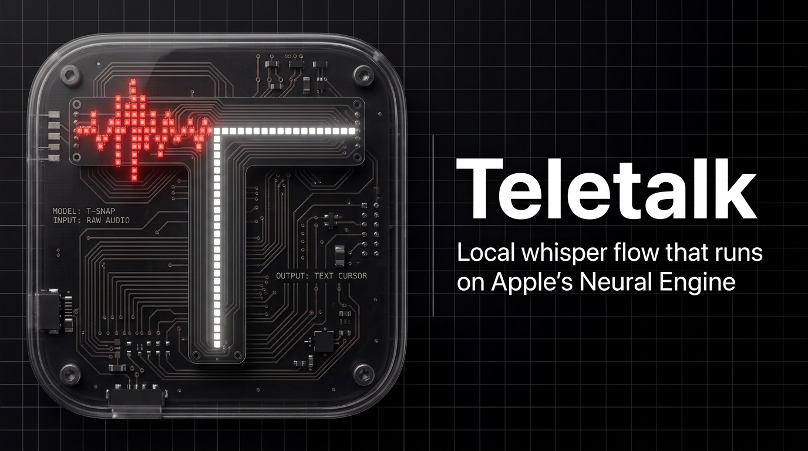

<p align="center">
  
</p>

# TeleTalk

Hold a hotkey. Speak. Release. Your words appear at the cursor — transcribed entirely on-device, with zero network calls, zero subscriptions, and zero compromises on privacy.

TeleTalk is a macOS menu bar app for offline voice dictation, powered by NVIDIA's Parakeet TDT model running on Apple Silicon via [FluidAudio](https://github.com/FluidInference/FluidAudio).

## Features

### Core

- **100% offline** — audio never leaves your Mac, ever
- **Apple Neural Engine** — Parakeet TDT 0.6B runs on the ANE for near-zero battery impact
- **System-wide** — works in any text field via the Accessibility API, with clipboard-paste fallback
- **Two hotkey modes** — toggle (press to start, press to stop) and hold-to-talk (hold to record, release to transcribe)
- **Escape to cancel** — hit Escape mid-recording or mid-transcription to abort

### Text Shortcuts

- **Alias expansion** — define text macros that expand after transcription. Say "auq" and get "you are allowed to ask me any questions". Alias triggers are automatically registered with the ASR model's vocabulary boosting so it actually recognizes your made-up words
- **Emoji insertion** — say "emoji fire" and get 🔥. Powered by GitHub's [gemoji](https://github.com/github/gemoji) dictionary (~1,800 emoji), downloaded on-demand when you first enable the feature

### Personal Dictionary

- **Vocabulary boosting** — add custom terms (names, jargon, brands) with optional pronunciation aliases so Parakeet transcribes them correctly
- **CTC model biasing** — uses a small CTC model (~64 MB) to bias the transcription beam search toward your vocabulary

### Multi-Model Support

- **Download & switch** between Parakeet TDT models — v2 (English) and v3 (multilingual)
- **Manage disk usage** — see per-model sizes, delete models you don't need

### Audio

- **Input device picker** — choose between built-in mic, USB, Bluetooth, or system default
- **Configurable recording limits** — set max duration (30s–5m) and minimum duration threshold
- **Audio feedback** — macOS Dictation sounds on recording start/stop

### History & Menu Bar

- **Transcription history** — searchable log of everything you've dictated, with timestamps, word counts, and model version
- **Rich menu bar** — today's stats, last 3 transcriptions (click to re-insert), active keybinds, model & input device quick-switchers
- **Floating overlay** — animated pill with real-time waveform while recording, status indicators for transcribing/done/error

### Settings

Eight tabs of configuration: Hotkeys, Audio, Models, Dictionary, Shortcuts, General, History, and Permissions. Launch at login, overlay positioning, insertion method selection, and more.

## Requirements

- macOS 14.0+ (Sonoma)
- Apple Silicon (M1 or later)
- Microphone, Accessibility, and Input Monitoring permissions

## Install

```bash
git clone https://github.com/newtoallofthis123/teletalk.git
cd teletalk
./install.sh
```

The installer builds from source, lets you choose between ad-hoc signing (no Apple account) or signing with your Developer ID, and copies the app to `/Applications`.

**Manual build** (if you prefer Xcode):

```bash
open Teletalk.xcodeproj
# Build & Run with Cmd+R
```

Or from the command line:

```bash
xcodebuild -project Teletalk.xcodeproj -scheme Teletalk -configuration Release -derivedDataPath build
cp -r build/Build/Products/Release/Teletalk.app /Applications/
```

The transcription model (~600 MB) downloads automatically on first launch.

## How It Works

1. **Hotkey** — global shortcut (Ctrl+Shift+Space or Ctrl+Shift+L) triggers recording
2. **Audio capture** — AVAudioEngine records mic input, converts to 16kHz mono Float32 PCM
3. **Transcription** — FluidAudio runs Parakeet TDT on the Apple Neural Engine, with optional CTC vocabulary boosting
4. **Post-processing** — alias expansion and emoji insertion transform the raw transcript
5. **Text insertion** — final text is inserted at cursor via the Accessibility API (clipboard paste as fallback)
6. **History** — the result is logged, and a floating overlay shows the status throughout

## License

[MIT](LICENSE)
